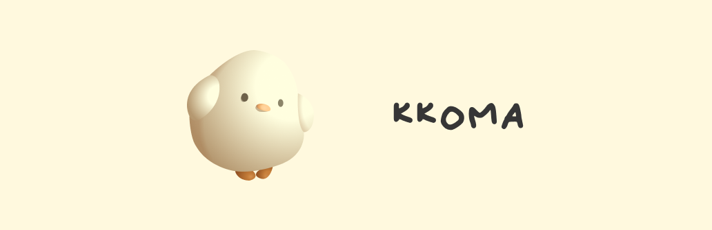
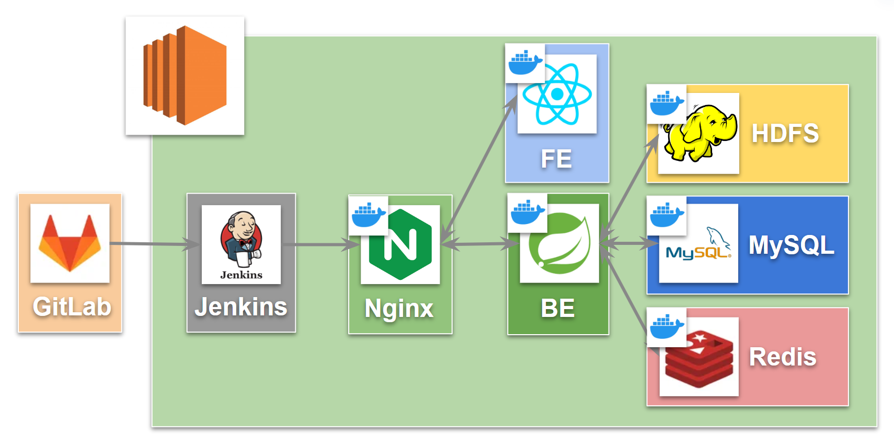
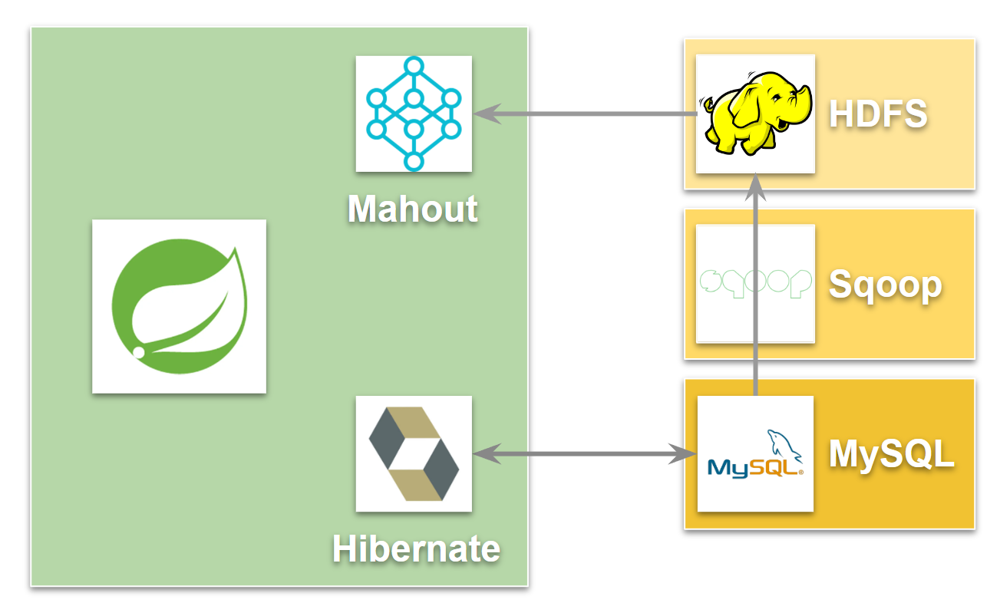
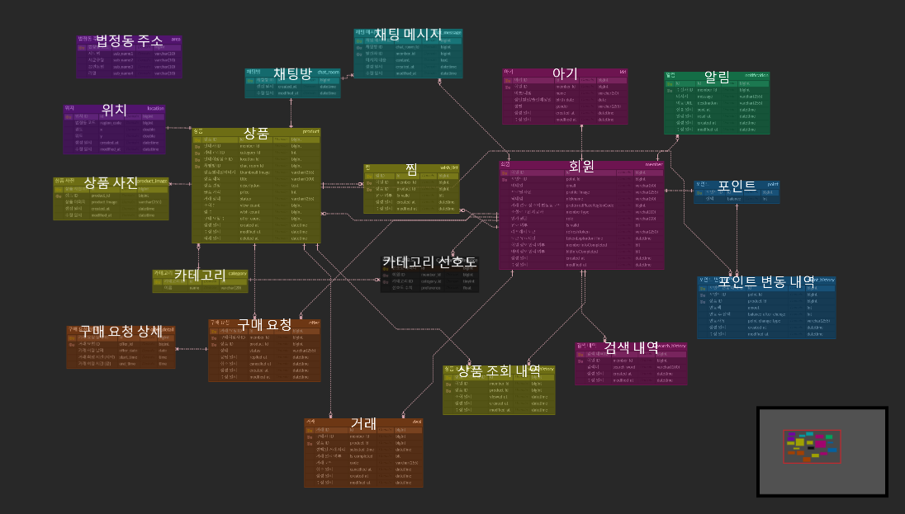

#### 목차

1. [프로젝트 소개](#-프로젝트 소개)   
2. [서비스 소개](#-주요-기능)  
5. [팀 소개](#-팀-소개)  

 
 
 
 
 
 

# 🐔 프로젝트 소개

빅데이터 기반 육아 용품 중고 거래 추천 플랫폼 개발 프로젝트

 

### 🐤 프로젝트 기간
2024.02.19 - 2024.04.04 (7주)

> **기획 및 설계** : 2024.02.19 - 2023.03.08 (3주)
>
> **기능 구현** : 2024.03.11 - 2024.04.04 (4주)

 
 
 
 
 
 

# 🐓 서비스 소개 

**서비스 명** : 꼬꼬마켓

 

### 🐣 특징
    ✔ 육아용품에 특화된 중고 거래 플랫폼
    ✔ 사용자 성향을 기반으로 한 거래글 추천 기능 

 

### 🐥 기술 스택
|구분|기술|
|:---|:---|
|Infra||
|Frontend||
|Backend||
|Management Tool|
|IDE||

 

### 🦜 설계

**인프라 아키텍쳐**

**백엔드 아키텍쳐**

**ERD 다이어그램**

**외부 문서**
- [와이어프레임](https://www.figma.com/file/rtugKRau06UXVcB2W1WwzH/KKOMA?type=design&node-id=144%3A5737&mode=design&t=KrA32jhI4t51iAsZ-1)

 

### 🦆 주요 기능

|구분|설명| BE 담당 | FE 담당 |
|:---|:---|:---|:---|
|거래|- 거래 요청 시 거래를 위한 금액을 미리 출금하고 서버에서 관리하여 사기 방지 - 거래 완료를 위해 QR 코드를 태그하는 방식을 사용|🐰김이현 🦝이수현 🐷조형준 🐹유소연|🐼최지우 🐻황인규|
|추천|- 협업 필터링을 활용하여 사용자가 원할 것 같은 거래글을 보여줌|🐷조형준|🐼최지우|
|검색|- ...|🐹유소연|🐼최지우|
|채팅|- WebSocket을 이용한 실시간 채팅 |🐰김이현|🐼최지우|
|알림|- ...|🦝이수현|🐻황인규|
|인증|- 카카오 소셜 로그인을 이용한 사용자 인증|🐷조형준|🐼최지우|

 

### 🕊 실행방법

exec 폴더 내 포팅 메뉴얼 참조

 
 
 
 
 
 

# 👨‍👩‍👧‍👦 팀 소개 

**삼성 청년 SW 아카데미** 10기 서울 3반 8조 깻잎마을방범대

<table>
  <tbody>
    <tr>
        <td align="center">
            <a href="#">
            
                 
                <b>김이현</b>
            </a>
             
            BE
        </td>
        <td align="center">
            <a href="#">
            
                 
                <b>조형준</b>
            </a>
             
            BE
        </td>
        <td align="center">
            <a href="#">
            
                 
                <b>유소연</b>
            </a>
             
            BE / Infra
        </td>
        <td align="center">
            <a href="#">
            
                 
                <b>이수현</b>
            </a>
             
            BE / Infra
        </td>
        <td align="center">
            <a href="#">
            
                 
                <b>최지우</b>
            </a>
             
            FE
        </td>
        <td align="center">
            <a href="#">
            
                 
                <b>황인규</b>
            </a>
             
            FE
        </td>
    </tr>
  </tbody>
</table>
