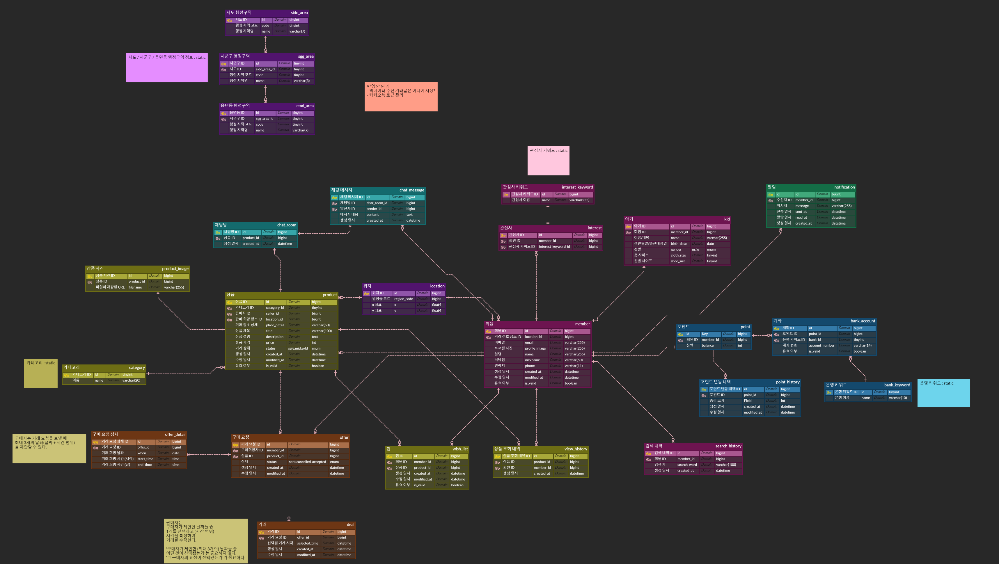

### 2024/03/04(월)
- 기획 확정: [빅데이터 기반 육아 용품 중고 거래 추천 플랫폼](https://www.notion.so/todays-jiwoo/b53dcdc16603436d950981179a778c26?pvs=4)
- 기능 구체화

### 2024/03/05(화)
- 기획 완성 day with 리현
- [요구사항 명세서](https://www.notion.so/todays-jiwoo/c9cc3088d26141f19d567045e479d560?v=a9af1601e5614c3f81b1ee5b527c45a7&pvs=4) 완성
- [기능 명세서](https://www.notion.so/todays-jiwoo/359c01f26b73420b80f354c323c44792?pvs=4) 완성

### 2024/03/06(수)
- MVP 위한 [스토리보드](https://www.notion.so/todays-jiwoo/MVP-29836330364648f7b73d75d104587122?pvs=4) 작성

### 2024/03/07(목)
- 백엔드 킥오프 회의
- DB 모델링

### 2024/03/08(금)
- 중간 발표
- ERD 설계

### 2024/03/11(월)
- ERD 완성
- 일정 산출 / 역할 분담
- [인프라 기초 설계](https://www.notion.so/todays-jiwoo/8531ed812a8547cfa43658dbda239088?pvs=4)

### 2024/03/12(화)
- EC2 서버 설정
- docker compose 구성
